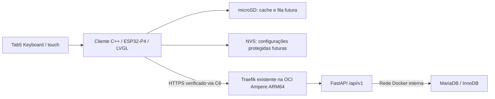

# Arquitetura e contratos

A especificação completa foi recebida em 08/10/2026. As versões obedecem à seção 29.
Uma etapa sem testes físicos aprovados não equivale a uma versão estável.

O diagrama representa a arquitetura alvo. Nesta branch estão somente a plataforma
Tab5 e seu núcleo portátil; os componentes de nuvem serão integrados na v0.2.0.
ESP32-P4 e ESP32-C6 são RISC-V; ARM64 é a arquitetura do servidor Ampere.

## Limites

- O firmware nunca recebe credenciais SQL nem executa SQL no banco central.
- admin-local pode recuperar rede/dispositivo; sua senha não concede sessão ERP.
- Confirmação inicial de venda exige backend online. Carrinho offline é rascunho.
- Pagamentos registrados são declarados; confirmação Pix/TEF exige integração futura.
- Comprovantes iniciais serão não fiscais.
- API calcula preços/totais e valida RBAC, estoque e caixa numa transação.

## Contrato planejado firmware/API

HTTPS, JSON UTF-8, versão `/api/v1`, corpo inicial máximo 64 KiB. Access token opaco
curto e refresh rotativo protegidos em memória interna; nenhum token em microSD.
Paginação máxima 100 registros. Valores monetários serializados como strings decimais
(exemplo estrutural `"12.34"`), convertidos em centavos inteiros no cliente.
Quantidade em milésimos, arredondamento HALF_UP por linha; API é autoridade final.
Erros: `{error: {code, message, correlation_id}}`; cabeçalho `X-Correlation-ID`.

Compatibilidade será negociada por capabilities e versão, sem supor que todos
os módulos existem. Contratos comerciais ainda não foram publicados.

## Concorrência

LVGL protegido pelo mutex BSP. I²C do teclado em tarefa separada; eventos numa fila
FreeRTOS limitada. Rede futura em worker separado da interface. MicroSD tem único
escritor planejado, arquivos temporários e recuperação de corrupção na v0.11.0.
Nenhuma venda finalizada é apagada; UUID/idempotência duráveis no backend.
